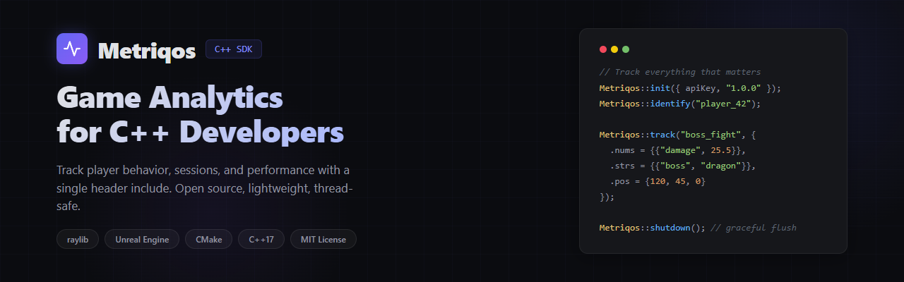

<p align="center">
  
</p>

<p align="center">
  <strong>Official C++ SDK for <a href="https://metriqos.io">Metriqos</a> game analytics.</strong><br>
  Lightweight, open source, thread-safe. Works with raylib, Unreal Engine, and any C++ project.
</p>

<p align="center">
  <a href="https://github.com/CedraInteractive/metriqos-sdk-cpp/blob/main/LICENSE"></a>
  <a href="https://metriqos.io"></a>
  
</p>

---

## Features

- Automatic session tracking and heartbeat
- Event batching with configurable intervals
- SQLite offline queue for unreliable networks
- Jittered exponential backoff on failures
- Platform-specific device info collection (Windows, macOS, Linux)
- GDPR opt-out with a single call
- Thread-safe, non-blocking design

## Quick Start

```cpp
#include "metriqos/metriqos.h"

int main() {
    Metriqos::Config config;
    config.apiKey = "mq_live_your_key_here";
    config.appVersion = "1.0.0";
    Metriqos::init(config);

    Metriqos::identify("player_42");

    Metriqos::EventData event;
    event.nums["score"] = 1500.0;
    event.strs["level"] = "3-1";
    Metriqos::track("level_complete", event);

    Metriqos::shutdown();
    return 0;
}
```

## Integration

### CMake (add_subdirectory)

```cmake
add_subdirectory(metriqos-sdk-cpp)
target_link_libraries(your_game PRIVATE metriqos)
```

### Dependencies

All dependencies are handled automatically:

- **libcurl** — fetched via CMake FetchContent
- **nlohmann/json** — fetched via CMake FetchContent
- **SQLite3** — bundled in `third_party/`

## Build from Source

```bash
git clone https://github.com/CedraInteractive/metriqos-sdk-cpp.git
cd metriqos-sdk-cpp
cmake -B build
cmake --build build
```

### Run Tests

```bash
cmake -B build -DMETRIQOS_BUILD_TESTS=ON
cmake --build build
cd build && ctest --output-on-failure
```

## API Reference

| Function | Description |
|----------|-------------|
| `Metriqos::init(config)` | Initialize the SDK, start session and background threads |
| `Metriqos::shutdown()` | Flush remaining events, end session, clean up |
| `Metriqos::identify(playerId)` | Set the player identity |
| `Metriqos::track(name, data)` | Send a custom event |
| `Metriqos::setUserProperty(key, value)` | Attach metadata to every subsequent event |
| `Metriqos::setOptOut(true)` | Disable all tracking (GDPR / Apple ATT) |
| `Metriqos::flush()` | Force-send all queued events |
| `Metriqos::getStatus()` | Get queue size, offline count, and quota info |

## Configuration

```cpp
Metriqos::Config config;
config.apiKey = "mq_live_...";                        // Required
config.appVersion = "1.0.0";                           // Recommended
config.endpoint = "https://api.metriqos.io";           // Default
config.batchIntervalMs = 30000;                        // Flush every 30s
config.batchSize = 50;                                 // Flush at 50 events
config.collectDeviceInfo = true;                       // Auto-collect OS/CPU/RAM
config.offlineQueueSize = 500;                         // Max offline events
config.heartbeatIntervalSec = 60;                      // Heartbeat interval
config.debug = false;                                  // Enable console logging
```

## Event Tracking

```cpp
Metriqos::EventData event;

// Numeric values
event.nums["damage"] = 25.5;
event.nums["health"] = 100.0;

// String values
event.strs["weapon"] = "sword";
event.strs["boss_id"] = "dragon_01";

// Tags
event.tags = {"pvp", "ranked"};

// Position (for heatmaps)
event.pos = {120.0f, 45.0f, 0.0f};
event.hasPos = true;

// Map identifier
event.mapId = "world_1";

// Event category (session, performance, gameplay, economy, system, custom)
event.category = "gameplay";

Metriqos::track("boss_fight", event);
```

## User Properties

Properties set via `setUserProperty` are automatically attached to every subsequent event:

```cpp
Metriqos::setUserProperty("tier", "gold");      // string → strs map
Metriqos::setUserProperty("player_level", 42.0); // number → nums map
```

## Privacy

```cpp
Metriqos::setOptOut(true);  // Stops all tracking, clears event queue
Metriqos::setOptOut(false); // Resumes tracking
```

## License

MIT — see [LICENSE](LICENSE) for details.
